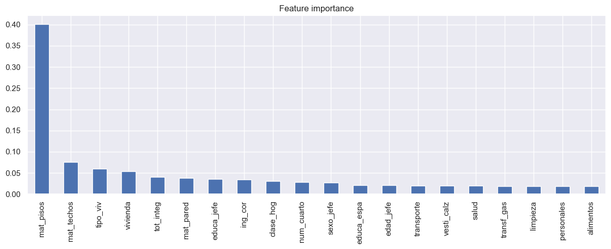
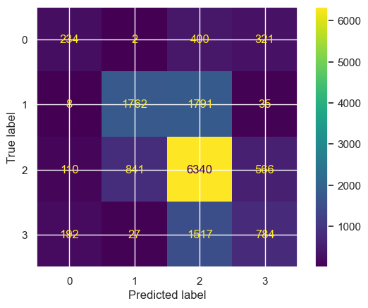
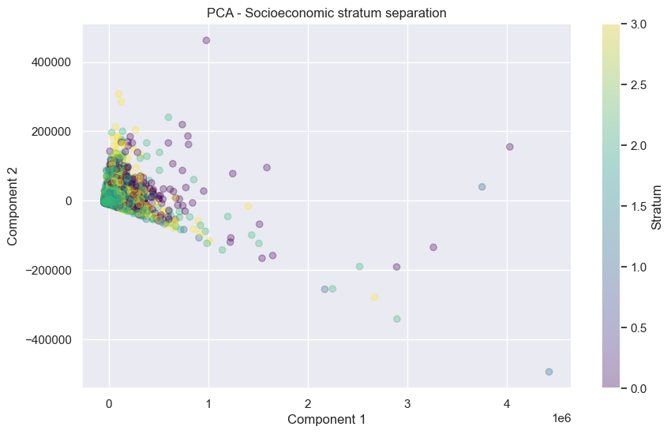

# 🇲🇽 Machine Learning Analysis of ENIGH Database


## Description

Can we predict where a Mexican household falls on the socioeconomic ladder — just from survey data?

This project applies a **Random Forest classification model** to data from the 2018 National Household Income and Expenditure Survey (ENIGH) by INEGI. The goal is to classify households into four socioeconomic strata based on income, expenditure, and housing characteristics — and to understand which variables actually drive inequality in Mexico.

## Objective

Classify Mexican households into four socioeconomic strata:

| Stratum | Label |
|---|---|
| 1 | Low |
| 2 | Lower-middle |
| 3 | Upper-middle |
| 4 | High |

## Results

- **Model:** Random Forest Classifier
- **Accuracy:** 61%
- **Most important variables:** Current income, transportation expenditure, and type of dwelling

## Visualizations

### Feature Importance


### Confusion Matrix


### PCA Projection by Stratum


## Key Findings

- Income and expenditure variables are stronger predictors of socioeconomic stratum than physical housing characteristics
- Middle strata are predicted more accurately than extreme strata
- PCA projection confirmed significant overlap between strata, explaining the model's accuracy ceiling
- A 61% accuracy reflects the genuine complexity of socioeconomic classification — not a model failure

## How to Run

1. Clone the repository
   ```bash
   git clone https://github.com/AlexHaro25/Machine-learning-analysis-of-Enigh-database
   cd Machine-learning-analysis-of-Enigh-database
   ```

2. Install dependencies
   ```bash
   pip install pandas numpy matplotlib seaborn scikit-learn xgboost jupyter
   ```

3. Download the ENIGH 2018 dataset from the [INEGI website](https://www.inegi.org.mx/programas/enigh/nc/2018/) and place it in the project folder

4. Open the notebook
   ```bash
   jupyter notebook Enigh-ML-Analysis.ipynb
   ```

## Libraries

- `pandas` — data manipulation
- `numpy` — numerical computing
- `matplotlib` / `seaborn` — visualization
- `scikit-learn` — machine learning
- `xgboost` — gradient boosting

## Data Source

INEGI — Encuesta Nacional de Ingresos y Gastos de los Hogares (ENIGH) 2018
https://www.inegi.org.mx/programas/enigh/nc/2018/
